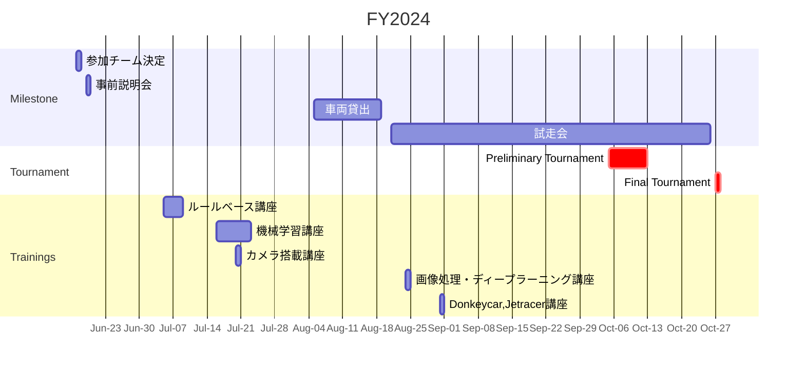

# Ninokin Racecar Docs

[![Contributors][contributors-shield]][contributors-url]
[![Forks][forks-shield]][forks-url]
[![Stargazers][stars-shield]][stars-url]
[![Issues][issues-shield]][issues-url]
[![Watchers][watchers-shield]][watchers-url]
[![MIT License][license-shield]][license-url]

[**Autonomous Minicar Battle**](https://github.com/autonomous-minicar-battle)
| [**Slides - Google Drive**](https://drive.google.com/drive/folders/17YLekXMTtOAwoKE8AF5WkMViXlS2xn-3)

## About the Project

This is the central docs for an awesome racecar that be able to automatically run the course. For questions and feedback, please reach out to us [here](https://github.com/nino-kin/racecar-docs/discussions).



## Prerequisites

Before you set up your environment, please check the following requirements:

- Docker 19+
  - Linux Hosts: Docker must be set to [run without sudo](https://docs.docker.com/engine/install/linux-postinstall/)
- Installation scripts requirements
  - bash
  - make

## Getting Started

Set up your environment to update any docs as follows:

### Run on Your Host Machine

```bash
python -m venv .venv
source .venv/bin/activate
pip install -r requirements.txt
```

Run the following command to start **mkdocs** locally, you can view docs and make changes. To view the served docs, need to navigate to [http://localhost:8000](http://localhost:8000). Any local changes will be automatically reloaded.

```bash
mkdocs serve
```

If you build the sites from docs, you should run the following command:

```bash
mkdocs build
```

### Run in Docker

View docs with mkdocs server with the following command:

```bash
make serve
```

Build the sites from docs as follows:

```bash
make build
```

## Pre-commit hook

Run `make pre-commit` to locally run the [pre-commit](https://pre-commit.com/) hook.

## Clean working directory

Clean you working directory with the following command:

```bash
make clean
```

<!-- MARKDOWN LINKS & IMAGES -->
<!-- https://www.markdownguide.org/basic-syntax/#reference-style-links -->

[contributors-shield]: https://img.shields.io/github/contributors/nino-kin/racecar-docs.svg?style=for-the-badge
[contributors-url]: https://github.com/nino-kin/racecar-docs/graphs/contributors
[forks-shield]: https://img.shields.io/github/forks/nino-kin/racecar-docs.svg?style=for-the-badge
[forks-url]: https://github.com/nino-kin/racecar-docs/network/members
[stars-shield]: https://img.shields.io/github/stars/nino-kin/racecar-docs.svg?style=for-the-badge
[stars-url]: https://github.com/nino-kin/racecar-docs/stargazers
[issues-shield]: https://img.shields.io/github/issues/nino-kin/racecar-docs.svg?style=for-the-badge
[issues-url]: https://github.com/nino-kin/racecar-docs/issues
[watchers-shield]: https://img.shields.io/github/watchers/nino-kin/racecar-docs.svg?style=for-the-badge
[watchers-url]: https://github.com/nino-kin/racecar-docs/watchers
[license-shield]: https://img.shields.io/github/license/nino-kin/racecar-docs.svg?style=for-the-badge
[license-url]: https://github.com/nino-kin/racecar-docs/blob/main/LICENSE
