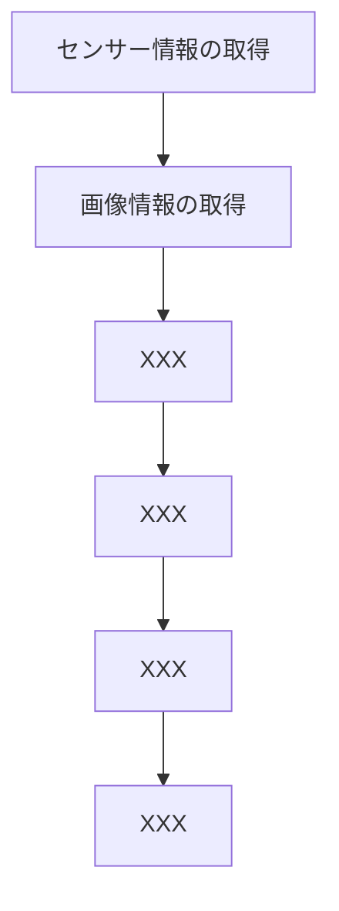

# Design

## Goal

1. 安定した周回走行
2. 分岐路で指定されたルートを走行
3. 指定されたエリアに駐車
4. 他車両の回避

## Rough Design



## Requirements

### Req 1

車両の状態を常に管理する。

取得できる（したい）車両の情報:

- 各センサの距離情報
- 画像の情報
- 走行時間
- 進行方向（直進、カーブ）
- モーター出力
- 操舵角
- 洗濯されているプラン
- 周回数
- 処理負荷

### Req 2

距離情報を取得する。

### Req 3

カメラデータを取得する。

### Req 4

画像処理と方向指示器の認識

方向指示器の認識: カメラからの画像を処理し、方向指示器を認識して進行方向を決定します。

方向指示器を検知した時にフラグかなにかを立てる。

### Req5

障害物回避アルゴリズム

回避動作: 障害物を回避するために、進行方向を変更したり、停止したりする処理を行います。

### Req 6

機械学習モデルの作成

- 速度制御: ラジコンカーの速度を調整します。障害物に近づいたときや方向転換の際には速度を落とす必要があります。
- 方向制御: ラジコンカーの進行方向を制御します。左右に曲がる、直進する、停止するなどの操作が含まれます。

### Req 7

駐車動作: 指定された駐車スペースに車両を停止させる動作です。駐車エリアの認識と、正確な位置決めが必要です。

### Req 8

マルチプロセス・マルチスレッドで処理を行い、パフォーマンスに留意すること。

cf. [【Raspberry Pi】爆速！ラズパイでマルチコア並列コンピューティング](https://murasan-net.com/2022/02/13/post-635/)

各プロセスの実行周期を上手に設計する必要がある。
IO操作は遅かった気がするので、別プロセスにしても良いのかもしれない。

Raspberry Piのようなリソースが限られた環境では、プロセスやスレッドの管理を効率的に行うことで、システム全体のパフォーマンスを向上させることが重要です。以下の点に注意して設計すると、リソースを効率的に使うことができます。

1. 非同期処理とスレッドの適切な使用
  非同期I/O (Async I/O): Raspberry Piでは、CPUリソースを節約するために、I/O操作（カメラ入力やセンサーの読み取りなど）は非同期で行うのが効果的です。Pythonのasyncioライブラリを使用すると、非同期処理を簡単に実装できます。

    - スレッド: 軽量なタスク（例：センサーのデータ取得）にはスレッドを使用します。threadingモジュールを使用して、マルチスレッド環境を構築することができます。ただし、スレッドを多用しすぎるとコンテキストスイッチングのオーバーヘッドが増えるので注意が必要です。

    - マルチプロセス: 重い計算を含むタスク（例：画像処理や機械学習推論など）にはマルチプロセスを使用します。multiprocessingモジュールを使用することで、各プロセスが独立したメモリ空間を持ち、複数のCPUコアを活用できます。

2. プロセス間通信 (IPC)
  スレッドやプロセス間でのデータ共有には、キュー (Queue) やパイプ (Pipe) などを使用します。これにより、データの整合性を保ちながら非同期にタスクを実行できます。
3. 優先順位とタスクのスケジューリング
  リソースが限られている場合、すべてのタスクを平等に扱うのではなく、重要度や緊急度に応じて優先順位をつけることが重要です。タスクのスケジューリングは、asyncioライブラリやOSレベルのスケジューリング機能を利用して行えます。
4. リソースの監視と動的な調整
  Raspberry Piのリソース使用率（CPU、メモリ、I/O）を定期的に監視し、必要に応じてタスクの実行頻度や優先順位を動的に調整します。例えば、CPU負荷が高い場合は、センサーの読み取り頻度を下げるなどの工夫が考えられます。
5. モジュール設計
  モジュールをできるだけ疎結合に設計することで、各機能を独立して最適化できます。また、再利用性が高まり、特定のモジュールに問題が生じた場合でもシステム全体に影響を与えにくくなります。

具体的な設計例:

**非同期I/Oを活用したデザイン**:

以下は、asyncioを使用して非同期にセンサーとカメラのデータを取得し、それに基づいて車両を制御する例です。

```python
import asyncio
import RPi.GPIO as GPIO

# センサーの非同期データ取得
async def get_sensor_data():
    while True:
        distance = get_distance()
        print(f"距離: {distance} cm")
        await asyncio.sleep(0.1)  # 100msごとに取得

# カメラの非同期データ取得
async def capture_camera_image():
    while True:
        image = capture_image()
        process_image(image)
        await asyncio.sleep(0.1)  # 100msごとに取得

# 車両の制御
async def control_vehicle():
    while True:
        direction = await decide_direction()
        move_vehicle(direction)
        await asyncio.sleep(0.1)  # 100msごとに制御更新

# メインループ
async def main():
    await asyncio.gather(
        get_sensor_data(),
        capture_camera_image(),
        control_vehicle()
    )

asyncio.run(main())

```

**マルチプロセスによる画像処理**:

重い画像処理タスクを別プロセスで実行し、メインプロセスの負荷を軽減する方法です。

```python
from multiprocessing import Process, Queue

# 画像処理を行うプロセス
def image_processing_task(image_queue):
    while True:
        if not image_queue.empty():
            image = image_queue.get()
            processed_image = process_image(image)
            # 処理結果の使用、または別のキューに結果を渡す

# メインプロセス
def main():
    image_queue = Queue()
    p = Process(target=image_processing_task, args=(image_queue,))
    p.start()

    while True:
        image = capture_image()  # カメラから画像を取得
        image_queue.put(image)  # 画像をキューに追加

        # その他の制御やセンサー処理などを実行
        control_vehicle()

```

### Req 9

ログ出力機能

### Req 10

画像とモータ出力、操舵角のログをcsv形式か何かで記録する機能。

## Class

All classes:

<!-- no toc -->
- [Main controller](#main-controller)
- [Joystick](#joystick)
- [VehicleController](#vehiclecontroller)
- [SensorManager](#sensormanager)
- [PathPlanner](#pathplanner)
- [DataLogger](#datalogger)
- [State (Abstract class)](#state-abstract-class)
- [StoppedState](#stoppedstate)
- [MovingState](#movingstate)

### Main controller

- 役割: プログラムのエントリーポイントで、すべてのコンポーネントを統括するクラス。運転モードの切り替えも担当。
- 責任: 各コンポーネントの初期化、主な制御ループの管理、モードの切り替え。

```python
class MainController:
    def __init__(self):
        self.sensor_manager = SensorManager()
        self.vehicle_controller = VehicleController()
        self.path_planner = PathPlanner()
        self.data_logger = DataLogger()
        self.joystick = Joystick()
        self.mode = "manual"  # "manual" or "autonomous"

    def start(self):
        self.sensor_manager.initialize_sensors()
        self.vehicle_controller.initialize_vehicle()
        self.joystick.initialize()
        self.main_loop()

    def switch_mode(self):
        if self.mode == "manual":
            self.mode = "autonomous"
        else:
            self.mode = "manual"

    def main_loop(self):
        while True:
            if self.joystick.is_mode_switch_pressed():
                self.switch_mode()

            if self.mode == "manual":
                joystick_input = self.joystick.get_input()
                self.vehicle_controller.manual_drive(joystick_input)
            else:
                sensor_data = self.sensor_manager.get_sensor_data()
                self.vehicle_controller.update(sensor_data)

                # 自動運転モード開始時にMovingStateに変更
                if isinstance(self.vehicle_controller.state, StoppedState):
                    self.vehicle_controller.set_state(MovingState())

# 実際の動作開始
controller = MainController()
controller.start()
```

### Joystick

- 役割: ユーザーからの入力を受け付け、手動運転を可能にするクラス。
- 責任: ジョイスティックの初期化、入力の取得、モード切替ボタンの検出。

```python
class Joystick:
    def initialize(self):
        # ジョイスティックの初期化処理
        pass

    def get_input(self):
        # ジョイスティックからの入力を取得
        return {
            "steering": 0,  # ハンドルの角度
            "throttle": 0    # 加速・ブレーキ
        }

    def is_mode_switch_pressed(self):
        # モード切替ボタンが押されたかどうかをチェック
        return False

```

### VehicleController

- 役割: ラジコンカーの運転制御を行うクラス。手動運転と自動運転の両方に対応。
- 責任: センサーデータやジョイスティック入力に基づいて車両の制御を行う。

```python
class VehicleController:
    def __init__(self):
        # 初期状態としてStoppedStateを設定
        self.state = StoppedState()

    def initialize_vehicle(self):
        # 車両の初期化処理
        pass

    def set_state(self, new_state):
        # 状態を変更
        self.state = new_state

    def get_state(self):
        # 現在の状態を取得
        return self.state

    def update(self, sensor_data):
        # 現在の状態に基づいて車両を制御
        self.state.handle(self, sensor_data)

    def move_forward(self):
        # 前進するための実際の制御コード
        print("車両が前進しています")

    def stop(self):
        # 停止するための実際の制御コード
        print("車両が停止しています")

    def manual_drive(self, joystick_input):
        # 手動運転モードでジョイスティック入力に基づいて車両を制御
        steering = joystick_input['steering']
        throttle = joystick_input['throttle']
        print(f"Manual driving with steering: {steering}, throttle: {throttle}")
```

### SensorManager

- 役割: センサーの管理とデータ収集を行うクラス。
- 責任: 各種センサーの初期化、センサーデータの取得と提供。

```python
class SensorManager:
    def __init__(self):
        self.ultrasonic_sensor = UltrasonicSensor()
        self.camera_sensor = CameraSensor()

    def initialize_sensors(self):
        self.ultrasonic_sensor.initialize()
        self.camera_sensor.initialize()

    def get_sensor_data(self):
        return {
            "ultrasonic": self.ultrasonic_sensor.get_data(),
            "camera": self.camera_sensor.get_data()
        }

```

### PathPlanner

- 役割: 経路計画を行うクラス。
- 責任: コースのセグメントを基に進行方向やスピードを決定。

```python
class PathPlanner:
    def calculate_path(self, sensor_data):
        # 経路計画のロジック
        return "Calculated Path"

```

### DataLogger

- 役割: センサーデータや走行データを記録するクラス。
- 責任: データの保存と管理。機械学習用データセットの作成にも利用。

```python
class DataLogger:
    def __init__(self):
        self.log = []

    def log_data(self, data):
        self.log.append(data)
        # ファイルへの保存処理など

```

### State (Abstract class)

- 役割: 車両の状態（停止、進行、回避など）を表現するクラス群の基底クラス。
- 責任: 車両の異なる状態を扱うための共通インターフェースを提供。

```python
from abc import ABC, abstractmethod

class State(ABC):
    @abstractmethod
    def handle(self, vehicle_controller, sensor_data):
        pass

```

### StoppedState

- 役割: 車両が停止状態にあるときの動作を定義するクラス。
- 責任: 停止状態における処理を実装。

```python
class StoppedState(State):
    def handle(self, vehicle_controller, sensor_data):
        print("車両が停止状態")
        # 停止時の処理

```

### MovingState

- 役割: 車両が進行中の状態を定義するクラス。
- 責任: 進行状態における処理を実装。

```python
class MovingState(State):
    def handle(self, vehicle_controller, sensor_data):
        # センサーデータを基に車両の動作を決定
        obstacle_distance = sensor_data.get("ultrasonic")
        camera_image = sensor_data.get("camera")

        if obstacle_distance < 10:
            # 障害物が近い場合、停止状態に移行
            print("障害物を検知、停止状態に移行")
            vehicle_controller.set_state(StoppedState())
        else:
            # 障害物が遠い場合、前進を続ける
            print("前進中...")
            vehicle_controller.move_forward()

        # カメラの映像解析やその他の処理をここで実行可能
        # camera_imageの解析結果に応じてさらに制御を行う

```
