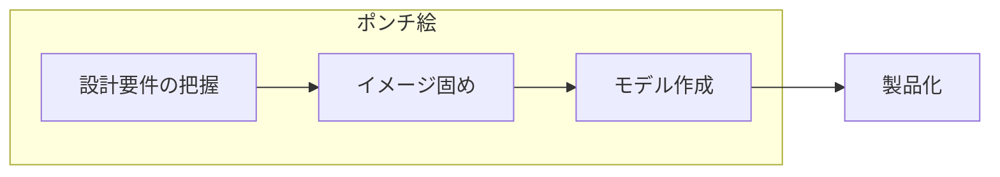

# Hardware Design

## Quick Links

- [Autodesk Fusion 360 - GitHub](https://github.com/AutodeskFusion360)

## Process

## ポンチ絵

手書きで書いた絵

### Types

#### 投影図

1. 主となる面視を決める
2. 主投影図（正面図）を描く
3. 側面図・平面図を描く

寸法入れ

#### 立体図

- キャビネット図
- 等角図
