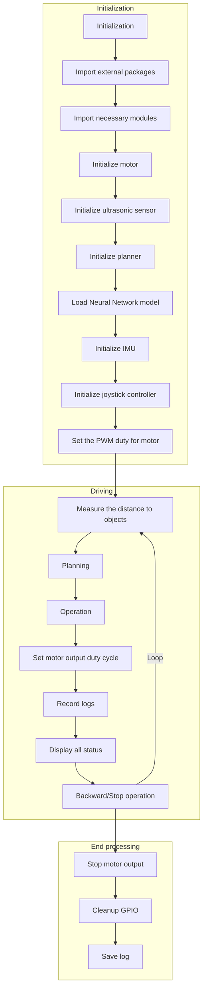

# Togikai Sample Program

[**Autonomous Minicar Battle**](https://github.com/autonomous-minicar-battle)
| [**Slides - Google Drive**](https://drive.google.com/drive/folders/17YLekXMTtOAwoKE8AF5WkMViXlS2xn-3)

## Main Program

| File name        | Description |
|------------------|-------------|
| run.py           | 走行時のループ処理をするメインプログラム |
| config.py        | パラメータ用プログラム |
| ultrasonic.py    | 超音波測定用プログラム |
| planner.py       | 走行ロジック用プログラム |
| motor.py         | 操舵・モーター出力/調整用プログラム |
| train_pytorch.py | 機械学習用プログラム |

## run.py

